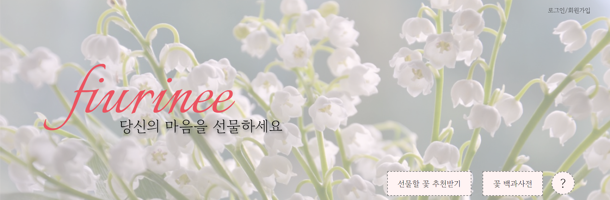

# 🌹 Fiurinee (피우리니)
**👐🏻 Fiurinee(피우리니)는 프론트엔드, 모델, 백엔드 3분야의 파트가 협업하여 만든 사이트로 연인, 친구, 가족 등 소중한 사람에게 선물할 맞춤형 꽃 추천 서비스입니다.**

